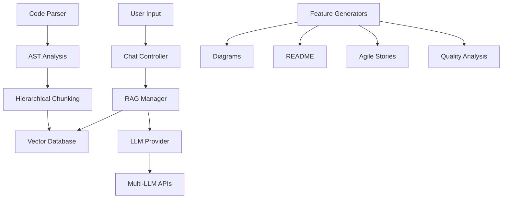

# DevCanvas AI - VS Code Extension

🎨 **DevCanvas AI** is a powerful VS Code extension that integrates an advanced, context-aware AI chatbot directly into your development workflow. It provides deep codebase understanding, intelligent documentation generation, interactive diagramming, and comprehensive code analysis.

## ✨ Features

### 🧠 Deep Code Understanding
- **RAG-Powered Analysis**: Uses Retrieval-Augmented Generation with vector embeddings for semantic code search
- **Multi-Language Support**: TypeScript, JavaScript, Python, Java, C++, Go, Rust, and more
- **Hierarchical Chunking**: AST-based parsing for precise code context

### 🤖 Multi-LLM Support
- **Google Gemini Flash** (Default - Fast & Efficient)
- **Google Gemini Pro** (Advanced Reasoning)
- **OpenAI GPT-4** (Premium Features)
- **Anthropic Claude 3** (Long Context)

### 📊 Smart Features
- **Interactive Diagrams**: Generate Mermaid.js diagrams with clickable navigation to source code
- **README Generation**: Comprehensive project documentation with setup instructions
- **Agile Story Creation**: Convert code analysis into Epic and User Stories with story point estimation
- **Code Quality Analysis**: Identify code smells, security issues, and improvement suggestions

### 🔗 Repository Integration
- **GitLab Integration**: Connect and analyze remote repositories
- **Bitbucket Support**: Access your Bitbucket projects
- **Zip File Upload**: Analyze uploaded codebases

## 🚀 Quick Start

### Installation
1. Install the extension from VS Code Marketplace
2. Open a workspace/project in VS Code
3. Click the **DevCanvas AI** icon in the sidebar
4. Configure your API keys using the configuration command

### Setup API Keys
1. Run the command: **"DevCanvas AI: Configure API Keys"**
2. Select your preferred LLM provider
3. Enter your API key
4. The extension will automatically index your workspace

### Get API Keys
- **Google Gemini**: [Google AI Studio](https://makersuite.google.com/app/apikey)
- **OpenAI**: [OpenAI API Keys](https://platform.openai.com/api-keys)
- **Anthropic**: [Anthropic Console](https://console.anthropic.com/)

## 💡 Usage Examples

### Basic Queries
```
"What does this codebase do?"
"How do I set up this project?"
"Show me the main entry points"
"Find all authentication-related code"
```

### Generate Documentation
```
"Generate a README for this project"
"Document the API endpoints"
"Create setup instructions"
```

### Create Diagrams
```
"Generate an architecture diagram"
"Create a class diagram"
"Show me a sequence diagram for user login"
```

### Agile Planning
```
"Create user stories for the authentication feature"
"Generate an epic for the API module"
"Estimate story points for the dashboard"
```

### Code Analysis
```
"Analyze code quality"
"Find security issues"
"Suggest improvements"
"Show complexity metrics"
```

## 🛠️ Commands

| Command | Description |
|---------|-------------|
| `DevCanvas AI: Index Current Workspace` | Analyze and index your codebase |
| `DevCanvas AI: Configure API Keys` | Set up LLM provider credentials |
| `DevCanvas AI: Clear Index` | Remove all indexed data |
| `DevCanvas AI: Generate README` | Create project documentation |
| `DevCanvas AI: Generate Architecture Diagram` | Visualize system structure |

## ⚙️ Configuration

### Settings
- `devcanvas.autoIndex`: Automatically index workspace on startup (default: true)
- `devcanvas.maxChunks`: Maximum code chunks for context (default: 10)
- `devcanvas.chunkSize`: Maximum size of code chunks (default: 1000)

### Data Storage
- All data is stored locally in your VS Code workspace
- Vector embeddings: `.vscode/devcanvas.lance`
- Chat history: VS Code workspace storage
- API keys: VS Code secure storage

## 🏗️ Architecture



## 🔒 Privacy & Security

- **Local-First**: All data processing happens locally
- **No Data Leakage**: Your code stays in your workspace
- **Secure API Keys**: Stored using VS Code's secure storage
- **Optional Cloud**: Only LLM API calls for processing (you control what's sent)

## 🛡️ Security Features

- Identifies hardcoded secrets and credentials
- Detects potential security vulnerabilities
- Suggests secure coding practices
- Input validation analysis
- Authentication/authorization review

## 📋 Requirements

- **VS Code**: Version 1.80.0 or higher
- **Node.js**: Version 18 or higher (for development)
- **API Key**: At least one supported LLM provider

## 🧪 Development

### Build from Source
```bash
git clone <repository-url>
cd devcanvas-ai
npm install
npm run compile
```

### Run Extension
1. Open in VS Code
2. Press `F5` to launch Extension Development Host
3. Test in the new VS Code window

### Package Extension
```bash
npm install -g vsce
vsce package
```

## 📊 Performance

- **Fast Indexing**: Efficient AST parsing and chunking
- **Smart Caching**: Embeddings cached locally
- **Incremental Updates**: Only re-index changed files
- **Memory Efficient**: Streaming for large codebases

## 🤝 Contributing

We welcome contributions! Please see our [Contributing Guidelines](CONTRIBUTING.md) for details.

### Development Setup
1. Fork the repository
2. Create a feature branch
3. Make your changes
4. Add tests
5. Submit a pull request

## 📄 License

This project is licensed under the MIT License - see the [LICENSE](LICENSE) file for details.

## 🆘 Support

- **Issues**: [GitHub Issues](https://github.com/your-repo/devcanvas-ai/issues)
- **Discussions**: [GitHub Discussions](https://github.com/your-repo/devcanvas-ai/discussions)
- **Documentation**: [Full Documentation](https://docs.devcanvas.ai)

## 🗺️ Roadmap

- [ ] **Enhanced Language Support**: More programming languages
- [ ] **Team Collaboration**: Shared indexes and insights
- [ ] **CI/CD Integration**: Automated code analysis in pipelines
- [ ] **Advanced Diagrams**: Database schemas, network architecture
- [ ] **Code Generation**: AI-powered code suggestions and completion
- [ ] **Performance Analytics**: Runtime performance insights

## ⭐ Acknowledgments

- Built with [LanceDB](https://lancedb.com/) for vector storage
- Powered by leading LLM providers
- Inspired by the VS Code extension community

---

**Made with ❤️ for developers who love clean, documented, and well-architected code.**